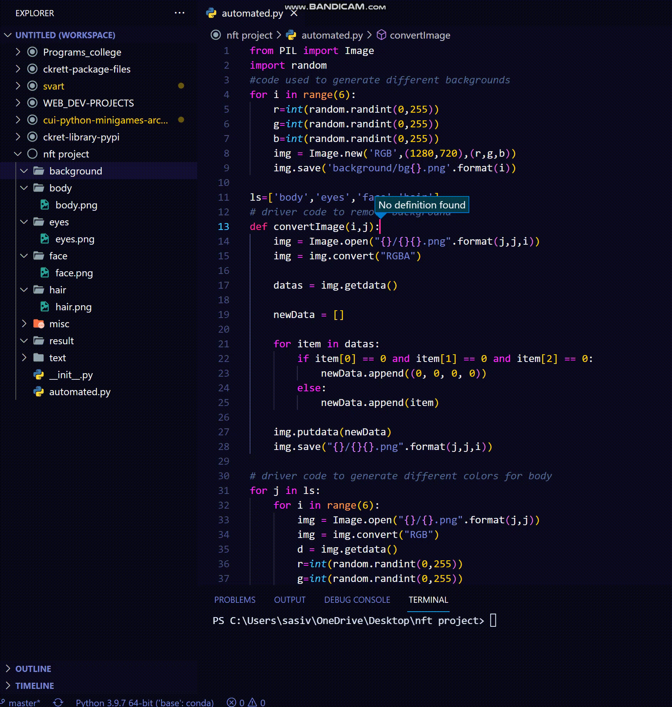

<h1 align="center">Automated NFT generator 🤖👨🏻‍💻</h1>
<h2 align="center">version-1️⃣.0️⃣.0️⃣</h2>
This repo contains a mini side project i've done using <b>PILLOW module</b> in python. I wrote an automated script which generates thousands unique nfts with 0 hassle in less time.

## So what is a NFT afterall?
==> NFT stands for Non-Fungible Token.Something that is "fungible" can be exchanged with an equivalent item.NFTs are digital items that can be bought and sold using this blockchain technology. But they are not fungible, making them a different type of asset.Like cryptocurrencies, NFTs are bought and sold on specialised platforms. OpenSea is the best-known NFT marketplace. As technology is rapidly growing many old methodologies are also changing, take crypto currency as an example, that might replace traditional paper money some time in future, NFT'S are one such kind which are very much hyped in 2022.

So..i've decided to make my own version of nft but i'm too lazy to draw , so i made an automated script which does all the hard work for me.

 

Intially i've choosen a random photo of my fav character Rick from series rick & morty, then i divided that photo into different layers using free online photo editing software <a href="https://www.photopea.com/">Photopea</a> (u can find them in misc dir).
 

Each original layer i.e un-colorized versions are placed in their respective folder/dir with folder name same as file name (required for script to run autonomously)

Then what left is to run the script, grab your'e coffee sit back and relax till the nft's are generated

## Preview for automated generation of colored layers once script is intiated:
 

### u can clearly observe how layers are generated in their respective folder from source layer,the process continues untill all specified folders are generated with given no.of unique colored layers

This generation of colored layers happens in 2 phases, in phase-1 colored versions with non-transparent backgrounds are generated which cannot be stacked on one another, thereby in phase-2 colored layers are made transparent by removing the background, then they are assigned with same file name as phase-1 and saved replacing the old png's with black bg by png's with transparent bg.

Then the last phase of script executes generating specified no.of nft's by retrieving the unique colored layers from their respective directories and stacking them one layer on top of another layer in different combinations, so that no two combinations were same craeting thousand of unique looking nft's which stored simultaneously in result directory
(here result dir is empty coz it's too large in size to upload on github)

# Final output looks something like this: 
This is a collage of few hundread generated nfts
 
(don't mind i hate windows)

## Notes:
### What makes this script standout from rest :
--> Almost everything is done autonomously leading near to no work\
--> In other automated scripts everything including different colored layers must be prepared before hand which is a lot of hard work, in this script all u have to do is create 'n' folders for you're 'n' layers and place source layer with same folder name in it's respective folder, colored layers with transparent bg's are prepared and saved automatically.\
--> u can specify no.of nft's u wanted to create, execution time is also relatively faster.

### note: 
--> Under GPL-3.0 license you are eligible to use the code how ever you want, but do not copy paste this as you're work/project anywhere , if done so it leads to copyright violation,you can avoid it by giving credit to me by linking this repo.

## that being said.....are NFT'S really future of digital currency ?!..idk....
